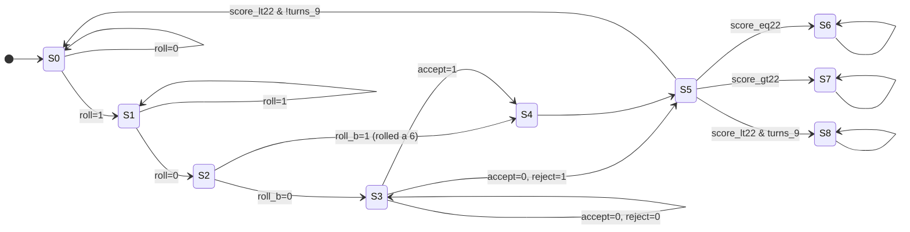

# "22" — An FPGA Dice Game

A single-player dice game implemented as a schematic-entry digital system on an
Intel MAX 10 FPGA (Terasic DE10-Lite). Built for a digital logic design course
lab, Spring quarter.

The player rolls a die and chooses whether to bank the result. The goal is to
reach a score of exactly **22**. Going over 22 loses immediately; failing to
reach 22 within **9 turns** also loses.

Rolling a **6** is not optional — it is banked automatically, with no accept or
reject decision offered.

---

## Demo

https://github.com/hsotima/fpga-dice-22/blob/main/docs/demo.mp4
                                    


---

## System Overview

The design is partitioned into four blocks:

| Block | Function |
| --- | --- |
| **Control FSM** | 9-state Moore machine sequencing the full game |
| **Die counter** | Moore machine cycling the die value at clock rate; the value at release is the roll |
| **Score processing unit** | Accumulates banked rolls and compares the running total against 22 |
| **Turn counter** | Counts turns and asserts `turns_9` on the final turn |

### Die counter and randomness

There is no random number generator in the design. The die is a Moore machine
that advances through its values continuously while the roll button is held —
at clock rate, far faster than a human can perceive or time. The roll is
whatever value the machine happens to be sitting in when the button is
released.

The randomness is therefore entirely in the asynchrony between the player's
release and the clock: the hold duration is unpredictable at the resolution of
a clock period, so the stopping state is unpredictable. This is the standard
trick for getting apparent randomness out of purely deterministic sequential
logic, and it costs one counter rather than an LFSR and seed logic.

### Score processing unit

Built from 7400-series library components in Quartus schematic entry:

- **7483** — 4-bit full adders, chained to add the current roll to the running score
- **74163** — synchronous 4-bit registers holding the accumulated score
- **7485** — magnitude comparator producing `score_lt22`, `score_eq22`, `score_gt22`

Using catalog TTL parts rather than behavioural HDL was a course constraint; it
forced explicit handling of carry chains and comparator cascading rather than
letting synthesis infer an adder.

---

## Control FSM

Nine states, one-hot encoded.

| State | Name | Meaning |
| --- | --- | --- |
| S0 | `Ready` | Idle, waiting for a roll |
| S1 | `Roll` | Die counter running while the roll input is held |
| S2 | `Turn` | Roll captured, turn registered |
| S3 | `Decision` | Waiting for the player to accept or reject the roll |
| S4 | `LoadScore` | Banked roll added into the score register |
| S5 | `CompareScore` | Running total compared against 22 |
| S6 | `Win` | Score is exactly 22 — terminal |
| S7 | `lose_22` | Score exceeded 22 — terminal |
| S8 | `lose_turns` | 9 turns elapsed below 22 — terminal |

### Condition signals

| Signal | Source | Meaning |
| --- | --- | --- |
| `roll` | Pushbutton (`KEY`, inverted) | Held to spin the die |
| `roll_b` | Decode of die counter output | Die shows a **6** |
| `accept` | Slide switch | Bank the current roll |
| `reject` | Slide switch | Discard the current roll |
| `score_lt22` | 7485 comparator | Running total < 22 |
| `score_eq22` | 7485 comparator | Running total = 22 |
| `score_gt22` | 7485 comparator | Running total > 22 |
| `turns_9` | Turn counter decode | Ninth turn reached |
| `reset` | Pushbutton | Return to `S0` from any state |



`reset=1` forces a return to `S0` from every state (arrows omitted above for
readability). The terminal states `S6`/`S7`/`S8` are self-looping and only
exit via reset.

### Next-state equations

With `reset=1`: `S0⁺ = 1`, `S1⁺…S8⁺ = 0`.

With `reset=0`:

```
S0⁺ = S0·roll' + S5·score_lt22·turns_9'
S1⁺ = S0·roll  + S1·roll
S2⁺ = S1·roll'
S3⁺ = S2·roll_b' + S3·accept'·reject'
S4⁺ = S2·roll_b  + S3·accept
S5⁺ = S4 + S3·accept'·reject
S6⁺ = S6 + S5·score_eq22
S7⁺ = S7 + S5·score_gt22
S8⁺ = S8 + S5·score_lt22·turns_9
```

Because the encoding is one-hot, each product term reduces to a single state
bit ANDed with its condition — no state decoder is required.

---

## Design Decisions

### Forcing the decision on a 6

`roll_b` decodes the die counter and asserts when the roll is a 6. It steers
`S2` straight to `S4` (`LoadScore`), bypassing `S3` (`Decision`) entirely — the
player is never offered accept or reject:

```
S3⁺ = S2·roll_b' + S3·accept'·reject'
S4⁺ = S2·roll_b  + S3·accept
```

This is what makes the game a game. Without it the optimal strategy is trivial:
reject every roll that would overshoot 22 and the player can never lose to the
score, only to the turn limit. Forcing the largest roll to be banked means a
player sitting close to 22 carries real risk on every roll, which is what
creates the tension between pushing for exactly 22 and running out of turns.

In FSM terms it is also cheap. The condition is a decode of the die value that
already exists, and the bypass costs one product term in `S4⁺` plus the
complement in `S3⁺` — no extra state, no extra register.

### State encoding: one-hot over binary

Nine states can be encoded in `⌈log₂ 9⌉ = 4` flip-flops binary, versus 9
flip-flops one-hot. The design uses one-hot anyway.

The tradeoff inverts depending on the target. On a discrete-logic
implementation — physical flip-flop packages on a breadboard — register count
dominates: 5 extra flip-flops means more packages, more board area, and more
static power, so binary wins.

On an FPGA the constraint is reversed. Logic elements pair a LUT with a
dedicated flip-flop, so the registers are already there and cost effectively
nothing; the scarce resource is LUT depth and routing. Binary encoding requires
decoding a 4-bit value to identify each state, adding a level of combinational
logic ahead of every next-state term and lengthening the critical path. One-hot
tests a single bit, so each next-state equation collapses to a narrow AND-OR
that fits one LUT. This is why Quartus defaults to one-hot for state machines
above a handful of states.

**When binary would win instead:** if the state count grew large enough that
one flip-flop per state became a real fraction of the device, or if the design
were retargeted to discrete logic or an ASIC where register area is billed
directly rather than sitting idle inside a logic element. At 9 states on a
MAX 10, neither applies.

### Robust design: simultaneous accept and reject

The Accept and Reject inputs are independent switches, so a player can assert
both at once. Rather than leaving the outcome to whichever signal wins a race,
the FSM resolves it by construction:

```
S4⁺ = S2·roll_b + S3·accept          ← no reject term
S5⁺ = S4 + S3·accept'·reject         ← guarded by accept'
```

`accept` is unconditional out of `S3`; `reject` is qualified by `accept'`.
Accept therefore takes priority and the roll is banked. Because the priority
lives in the next-state equations rather than in input conditioning, the
machine has exactly one defined successor for all four input combinations —
there is no unreachable or ambiguous case in the transition table.

---

## Debugging Log

The failures on this project were mostly at the boundary between the schematic
and the physical board, not in the state logic:

**Active-low pushbuttons.** The DE10-Lite `KEY` inputs idle high and pull low
when pressed. Wired directly, the FSM saw a continuously asserted `roll` and
sat in `S1`. Fixed by inverting the `KEY` inputs at the top level rather than
inverting the polarity of every downstream condition.

**PRN/CLRN conflict in the die counter.** The counter's asynchronous preset and
clear were both driven active under some conditions, leaving the flip-flop
outputs in an indeterminate state and producing rolls that skipped values.
Resolved by making the reset path exclusively synchronous clear and tying
preset inactive.

**Undriven LEDR pins.** Several score-display LEDs were left floating in the
pin assignment, which read as intermittent behaviour in the score path when the
score logic was actually correct. Assigning every used LEDR pin removed it.

Most of this was isolated by driving intermediate signals — current state,
comparator outputs, counter value — out to the LEDs and stepping the design by
hand on the board, rather than in simulation. Hardware LED debugging turned out
to be faster than ModelSim for problems that only existed once real switch
polarity and pin assignment were involved.

---

## Repository Layout

```
.
├── README.md
├── src/                    Quartus project and schematic sources
│   ├── *.bdf               Block diagram / schematic files
│   ├── *.qpf / *.qsf       Quartus project and settings
│   └── README.md           Build and programming instructions
├── sim/                    ModelSim testbenches and waveform scripts
├── docs/
│   ├── demo.mp4            Hardware demonstration
│   ├── schematics/         Exported PNG/PDF renders of each .bdf
│   └── prelab/             Original design work (handwritten)
└── .gitignore              Quartus build artefacts
```

---

## Design Documents

Original prelab design work, scanned:

| Document | Contents |
| --- | --- |
| [State diagram](docs/prelab/01-state-diagram.png) | Nine states, transitions, one-hot assignment |
| [State transition table](docs/prelab/02-state-table.png) | Exhaustive current-state / condition / next-state |
| [Next-state equations](docs/prelab/03-next-state-equations.png) | Derived one-hot equations |
| [Encoding tradeoff analysis](docs/prelab/04-encoding-tradeoffs.png) | One-hot vs binary |
| [Robust design analysis](docs/prelab/05-robust-design.png) | Simultaneous accept/reject |

---

## Tools

- **Quartus Prime** — schematic entry, synthesis, fitting, programming
- **ModelSim** — functional simulation
- **Terasic DE10-Lite** — Intel MAX 10 `10M50DAF484C7G`

---

## Context

Coursework project for a digital logic design lab. The specification, the
7400-series component constraint, and the schematic-entry requirement were set
by the course; the state machine design, score datapath, encoding choice, and
debugging are mine.
